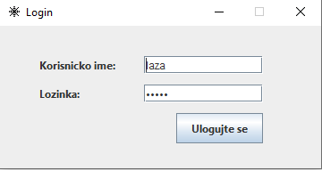
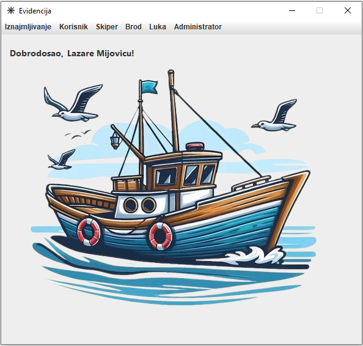
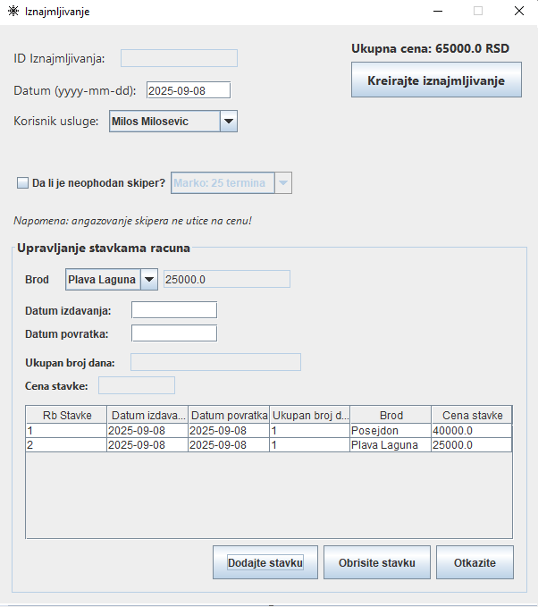
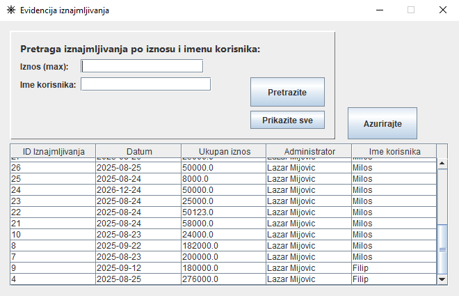
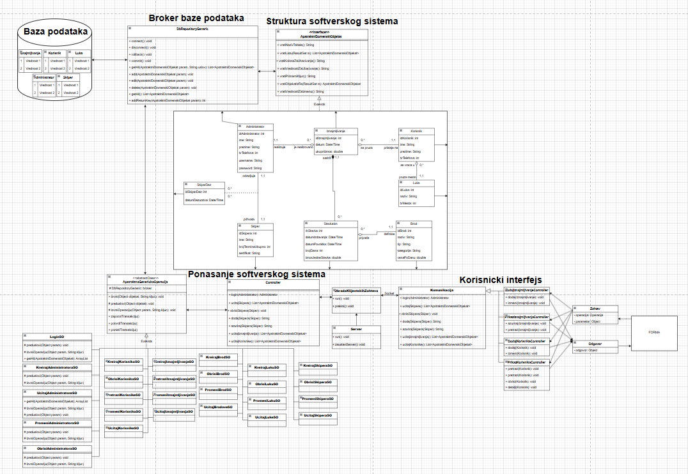
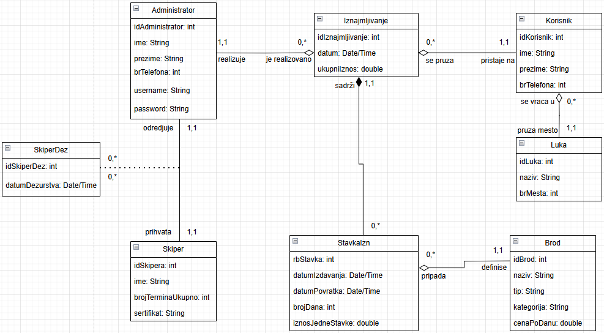
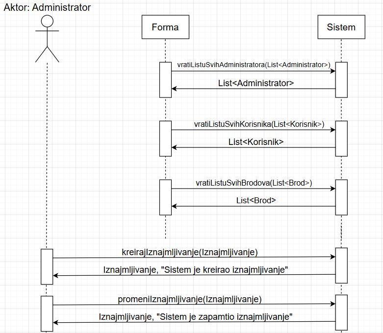

# ⛵ Boat Rental Management System

A robust, full-stack **Client-Server Desktop Application** developed in Java, designed to streamline and automate boat rental management operations. The system provides an intuitive interface for administrators to manage clients, ports, skippers, and complex rental agreements with real-time server processing and data persistence.

---

## 📸 User Interface Overview

### 🔐 Authentication & Main Dashboard
Secure administrator authentication opens up the main control dashboard, providing structured navigation through all system entities.

  
  

### 📄 Rental Management & Search
Administrators can easily manage rental contracts, insert items, select associated skippers/ports, and search historical records using advanced filter parameters.

  
  

---

## 🏗️ System Architecture & Design

The application follows a traditional **Three-Tier Architecture** utilizing socket-based TCP communication between the client presentation layer and the server backend.

+------------------+         TCP / Sockets         +------------------+         JDBC         +-------------------+
|  Client Desktop  |  <=========>  |  Server Application |  <>  | MySQL Database   |
|   (Swing GUI)    |   (Serialized Request/Resp)   | (Business Logic) |                      | (Data Persistence)|
+------------------+                               +------------------+                      +-------------------+

### 📐 Full System Architecture
The diagram below presents the complete structural decomposition of the application, highlighting the separation of UI Controllers, System Operations (SO pattern), Domain Logic, and the Generic Database Broker.

  

---

## 🗄️ Domain & Data Modeling

### 🔗 Domain Model
The core domain model captures the relationships between key business entities: **Administrator**, **Client (Korisnik)**, **Rental (Iznajmljivanje)**, **Boat (Brod)**, **Port (Luka)**, and **Skipper**.

  

### 🔄 Communication Sequence
Execution flow demonstrating a client request handling for rental creation through system operations and database transactional commit.

  

---

## ✨ Key Features & Capabilities

* **Multi-Tier Client-Server Communication**: Custom Socket/TCP network protocol exchanging serialized objects.
* **Complex Rental Transactions**: Real-time calculation of rental items, boat assignments, and optional skipper scheduling.
* **System Operation (SO) Pattern**: Encapsulates business logic rules and controls database transaction boundaries (commit/rollback).
* **Generic Database Broker**: Abstraction layer executing CRUD operations dynamically across all domain entities.
* **Search & Filtering**: Quick lookup for rentals, clients, and boats with responsive UI tables.

---

## ⚙️ Technical Stack

* **Programming Language**: Java (JDK 8+)
* **GUI Framework**: Java Swing
* **Networking**: Java Sockets (TCP/IP)
* **Database**: MySQL / MariaDB
* **Persistence Layer**: JDBC with Generic Broker Pattern
* **Design Patterns**: MVC, Command (System Operations), Generic Repository, Transfer Object (DTO)

---

## 🚀 Getting Started

### Prerequisites
* Java Development Kit (JDK) 8 or higher
* MySQL Server (e.g., via XAMPP or standalone installer)

### Setup & Run

1. **Database Setup**:
   * Import the SQL schema provided in the `/database` directory into your MySQL server.
   * Update the connection settings (URL, Username, Password) in `db.properties`.

2. **Start the Server**:
   * Run the Server application first to open the socket port and establish the database connection pool.

3. **Launch the Client**:
   * Start the Client application and log in using valid administrator credentials.
